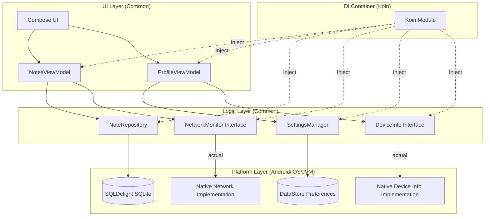

# 📝 My Notes App - Kotlin Multiplatform (Platform Features Upgrade)

A modern, offline-first notes management application built with Kotlin Multiplatform (KMP). This version includes advanced platform integrations, dependency injection, and real-time monitoring.

## Dokumentasi Visual

| Device Info (Settings) | Network Indicator (Online) | Network Indicator (Offline) |
| :---: | :---: | :---: |
|  |  |  |


## Video Demo
Video demo fitur aplikasi dapat diakses melalui tautan berikut : https://drive.google.com/file/d/10imbMC9cpMbY3RoqBv9-ww8orqdDHl1o/view?usp=sharing

## 🚀 Key Features

### 1. Koin Dependency Injection
- **Robust DI Setup**: All application dependencies (ViewModels, Repositories, Database, and Platform Services) are properly injected using Koin.
- **Clean Separation**: Architecture follows a strict separation of concerns, making the codebase highly maintainable.

### 2. Platform Feature Integration (expect/actual)
- **Device Info**: Native implementation to fetch system details like Model, OS Version, and Manufacturer.
- **Network Monitor**: Reactive monitoring of internet connectivity state across Android, iOS, and JVM.

### 3. Real-time Status UI
- **Network Status Indicator**: A dynamic banner "No Internet Connection" appears instantly when the device goes offline.
- **Device Info Display**: System details are neatly presented within the Personal Settings/Profile screen.

### 4. Local Persistence & CRUD
- **SQLDelight**: High-performance local database for all notes.
- **DataStore**: Persistence for user preferences like Dark Mode and Sort Order.

---

## 🏗️ Architecture Diagram

The project implements a clean architecture with Koin managing the dependency graph across all modules:



## 🛠️ Database Schema

```sql
CREATE TABLE NoteEntity (
    id INTEGER PRIMARY KEY AUTOINCREMENT,
    title TEXT NOT NULL,
    content TEXT NOT NULL,
    date TEXT NOT NULL,
    isFavorite INTEGER AS kotlin.Boolean NOT NULL DEFAULT 0,
    category TEXT NOT NULL DEFAULT 'General'
);
```

---

## 📂 Project Structure
- `di/`: Koin module definitions (`commonModule`) and initialization.
- `data/`: Repositories and DataStore management.
- `viewmodel/`: State-driven ViewModels with injected dependencies.
- `ui/`: Screens, Navigation, and reusable Compose components.
- `Platform Specifics`: `DeviceInfo.kt` and `NetworkMonitor.kt` using `expect/actual`.

---
**Developed by:** Andinirhm 🌸
**Course:** Pengembangan Aplikasi Mobile (PAM)
